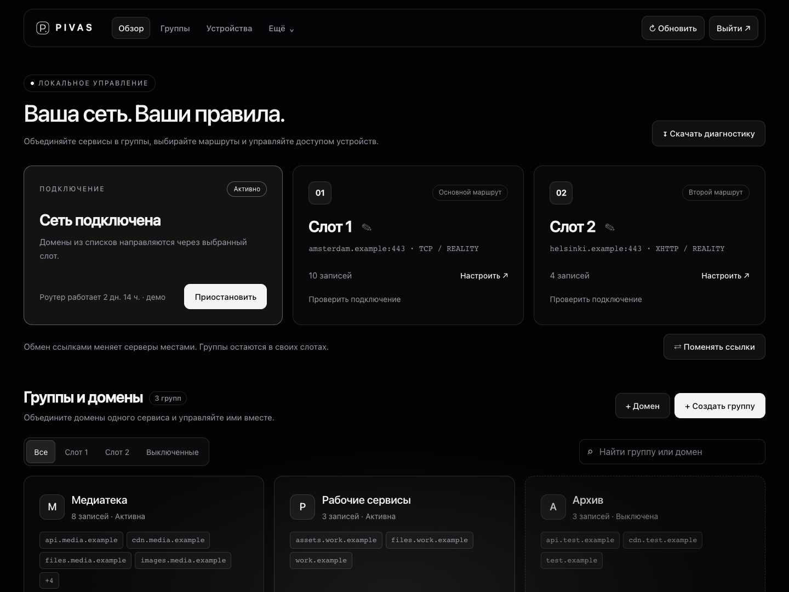

# Pivas

[Русский](README.md) · **English**

**Selective routing for Keenetic routers: two connection slots, domain groups, a web interface and Telegram control.**

Pivas routes selected websites and IPv4 networks through Xray while leaving other traffic on your regular connection. Manage your routing lists from a computer, a phone or Telegram.

Current bundle: **custom31 · Xray 26.3.27 · MIPSel / AArch64**. This is an evolving project: testing on individual devices does not establish compatibility with every Keenetic model.



[Light theme](docs/images/dashboard-light-demo.png) · [Mobile interface](docs/images/dashboard-mobile-demo.png)

## Features

- Two connection slots with custom names and a button to swap their connection profiles.
- VLESS TCP + Reality, gRPC + TLS, XHTTP + TLS/Reality, and Hysteria 2 with Salamander.
- Individual domains and domain groups: create, rename, move between slots, pause and delete.
- IPv4 addresses and CIDR networks in the same lists. A parent domain also covers its subdomains.
- Split DNS: listed domains use DNSCrypt/DoH through the corresponding slot; other domains use Keenetic's regular DNS resolver.
- Exclude up to **10 devices from Pivas**, with MAC-based rules and device discovery from Keenetic.
- A responsive web interface with automatic light/dark themes and Telegram bot settings.
- Telegram controls for groups, slots, the web service, diagnostics and compatible IPK updates.
- Encrypted configuration backups, diagnostic reports and resource usage measurements.

## Installation

First install Entware on a working EXT4 drive and enable these KeeneticOS components: **Proxy client**, **Open Package support**, **Netfilter**, and **EXT filesystem support**. See [INSTALL.md](INSTALL.md) for details (Russian).

Check the architecture in your Entware SSH session:

```sh
opkg print-architecture
```

| Entware architecture | Release archive |
| --- | --- |
| `mipsel-3.4` | `pivas-custom31-mipsel.tar.gz` |
| `aarch64-3.10` | `pivas-custom31-aarch64.tar.gz` |

There is no big-endian MIPS build. KN-1811 uses AArch64. Do not select an IPK solely from a generic `arch: mips` line in KeeneticOS.

### Download the full installer

| Entware architecture | Direct download |
| --- | --- |
| `mipsel-3.4` | [Download install-pivas-full.sh — MIPSel](https://github.com/GeorgeBenelli/pivas/releases/download/v1.1.9-25-custom31/install-pivas-full-mipsel.sh) |
| `aarch64-3.10` (including KN-1811) | [Download install-pivas-full.sh — AArch64](https://github.com/GeorgeBenelli/pivas/releases/download/v1.1.9-25-custom31/install-pivas-full-aarch64.sh) |

Each installer embeds the complete package. Check `opkg print-architecture`, download the matching file and name it **`/opt/tmp/install-pivas-full.sh`** when transferring it to the router. A fresh installation needs only that `.sh` file and access to the Entware repository.

[All custom31 downloads](https://github.com/GeorgeBenelli/pivas/releases/tag/v1.1.9-25-custom31) · [SHA256SUMS](https://github.com/GeorgeBenelli/pivas/releases/download/v1.1.9-25-custom31/SHA256SUMS)

Run it in Entware over SSH:

```sh
opkg update
sh /opt/tmp/install-pivas-full.sh
```

The installer includes Pivas, Xray, the QUIC helper, the web interface and the Telegram bot. It downloads dependencies from Entware; it does not install Entware or KeeneticOS components.

It prompts for slot URLs, a Telegram bot token and an administrator ID. Press Enter to skip a field and configure it later. Routing, the web interface and the bot are not enabled automatically on a fresh installation.

To configure Pivas through the web interface:

```sh
pivas web on 'REPLACE_WITH_YOUR_OWN_PASSWORD'
```

Open `http://ROUTER_ADDRESS:8888` and sign in as **admin**. Save a connection URL, create a domain group, then enable Pivas. To enable it from the command line:

```sh
pivas start
pivas status
pivas vless ping
```

The slot test checks the route through Xray. A successful test on the router does not by itself verify routing from client devices.

## Documentation

The detailed guides below are currently in Russian. This README, the short project descriptions and release notes are available in both languages.

| Task | Guide |
| --- | --- |
| Fresh installation, Entware and package selection | [Installation](INSTALL.md) |
| Slots, groups, devices and Telegram | [Configuration](SETUP.md) |
| DNS, routing and limitations | [Architecture](docs/ARCHITECTURE.md) |
| Updating over SSH or Telegram | [Updates](docs/UPDATING.md) |
| Unreachable websites or services that fail to start | [Troubleshooting](docs/TROUBLESHOOTING.md) |
| Builds, tests and local web preview | [Development](docs/DEVELOPMENT.md) |
| Changes in custom31 | [Release notes in English](RELEASE_NOTES.en.md) |
| GitHub About descriptions | [Russian and English descriptions](ABOUT.md) |
| Third-party source provenance | [Third-party notices](THIRD_PARTY_NOTICES.md) |

## Limitations and security

Routing in this version targets **IPv4**. IPv6 and application-level DoH can bypass domain rules. Pivas does not claim unconditional protection against all DNS leaks. Its web interface uses HTTP on the local network; do not expose port 8888 to the internet. See [SECURITY.md](SECURITY.md) for details (Russian).

Private TLS certificates can use SHA-256 pinning. Automatically fetching a pin at first connection requires trust in that first connection; verify it independently with the server administrator where possible.

The full package includes the bot and web interface, but you can enable or disable them separately. Hysteria 2 runs inside Xray and does not require a separate persistent Hysteria service.

## Development and attribution

This repository contains source code, tests and build tools. Binaries and installers are distributed separately through Releases and are not required for unit tests.

Pivas builds on [KVAS](https://github.com/qzeleza/kvas) and [telegram4kvas](https://github.com/dnstkrv/telegram4kvas), and uses Xray and pyTelegramBotAPI. The product name has changed; upstream attribution is retained. Components have different licensing terms: see [LICENSE](LICENSE) and [THIRD_PARTY_NOTICES.md](THIRD_PARTY_NOTICES.md).

**Before public redistribution of the complete bundle:** the upstream Telegram bot's licensing or redistribution permission still needs to be established. This preparation does not assign a new license to that code.
