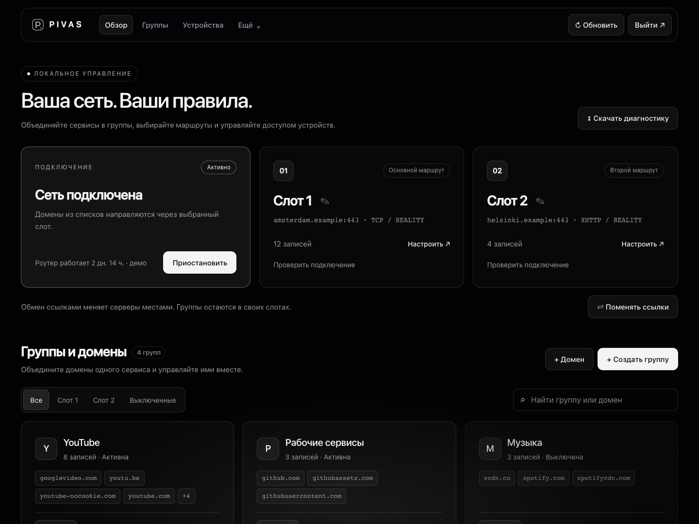

# Pivas

**Русский** · [English](README.en.md)

**Выборочная маршрутизация для Keenetic: два VPN-слота, группы доменов, веб и Telegram.**

Pivas направляет выбранные сайты и IPv4-сети через Xray, а остальной трафик оставляет на обычном подключении. Управлять списками можно с компьютера, телефона или из Telegram.

Текущий комплект: **custom31 · Xray 26.3.27 · MIPSel / AArch64**. Это развивающийся проект: проверка на отдельных устройствах не означает совместимость со всеми моделями Keenetic.



[Светлая тема](docs/images/dashboard-light.png) · [Мобильный интерфейс](docs/images/dashboard-mobile.png)

## Возможности

- Два слота с собственными названиями и обменом ссылками одной кнопкой.
- VLESS TCP + Reality, gRPC + TLS и XHTTP + TLS/Reality; Hysteria 2 с Salamander.
- Отдельные домены и группы: создание, переименование, перенос между слотами, пауза и удаление.
- IPv4-адреса и CIDR в тех же списках. Корневой домен охватывает поддомены.
- DNS по спискам: выбранные домены — через DNSCrypt/DoH соответствующего слота, остальные — через штатный DNS Keenetic.
- До **10 устройств без Pivas**, привязка исключения к MAC и получение списка устройств из Keenetic.
- Веб с автоматической светлой/тёмной темой, мобильной версией и настройками бота.
- Telegram: группы, слоты, веб, диагностика и установка совместимых IPK.
- Зашифрованная резервная копия настроек, диагностика и измерение нагрузки.

## Установка

Сначала установите Entware на исправный EXT4-накопитель и компоненты Keenetic **Proxy client**, **поддержка открытых пакетов**, **Netfilter**, **EXT**. Подробности и выбор архитектуры — в [INSTALL.md](INSTALL.md).

Скачайте из GitHub Releases архив своей архитектуры, распакуйте его **на компьютере** и передайте `install-pivas-full.sh` в `/opt/tmp/` роутера. В SSH-сессии Entware:

```sh
opkg update
sh /opt/tmp/install-pivas-full.sh
```

Установщик предложит ссылки слотов, токен Telegram и ID администратора. Можно пропустить поля Enter и заполнить их позже. На чистой установке VPN, веб и бот не включаются автоматически.

Для настройки через веб:

```sh
pivas web on 'ЗАМЕНИТЕ_НА_СВОЙ_ПАРОЛЬ'
```

Откройте `http://АДРЕС_РОУТЕРА:8888`, логин **admin**. Сохраните ссылку, создайте группу с доменами и включите Pivas. В CLI запуск выполняется командой `pivas start`.

## Документация

| Задача | Инструкция |
| --- | --- |
| Чистая установка, Entware и выбор пакета | [Установка](INSTALL.md) |
| Слоты, группы, устройства и бот | [Настройка](SETUP.md) |
| DNS, маршруты и ограничения | [Архитектура](docs/ARCHITECTURE.md) |
| Обновление через SSH или Telegram | [Обновление](docs/UPDATING.md) |
| Не открываются сайты, не запускается служба | [Диагностика](docs/TROUBLESHOOTING.md) |
| Сборка, тесты и демо веба | [Разработка](docs/DEVELOPMENT.md) |
| Изменения custom31 | [История версий](CHANGELOG.md) |
| Происхождение стороннего кода | [Лицензии и авторы](THIRD_PARTY_NOTICES.md) |

## Что важно знать

Маршрутизация в этой версии рассчитана на **IPv4**. IPv6 и собственный DoH приложений могут обойти доменные правила. Не заявляется полная защита от любых DNS-утечек. Веб работает по HTTP в локальной сети; не публикуйте порт 8888 в интернет. Детали — в [SECURITY.md](SECURITY.md).

Бот и веб устанавливаются вместе с полным пакетом, но их можно включать отдельно. Hysteria 2 работает внутри Xray; отдельная постоянно работающая служба Hysteria не нужна.

## Разработка и происхождение

Исходники, тесты и средства сборки находятся в этом репозитории. Бинарники и установщики распространяются отдельно через Releases; они не нужны для запуска модульных тестов.

Pivas развивает код [KVAS](https://github.com/qzeleza/kvas) и [telegram4kvas](https://github.com/dnstkrv/telegram4kvas), использует Xray и pyTelegramBotAPI. Название продукта изменено; авторство исходных компонентов сохранено. Условия компонентов различаются: [LICENSE](LICENSE), [THIRD_PARTY_NOTICES.md](THIRD_PARTY_NOTICES.md).
