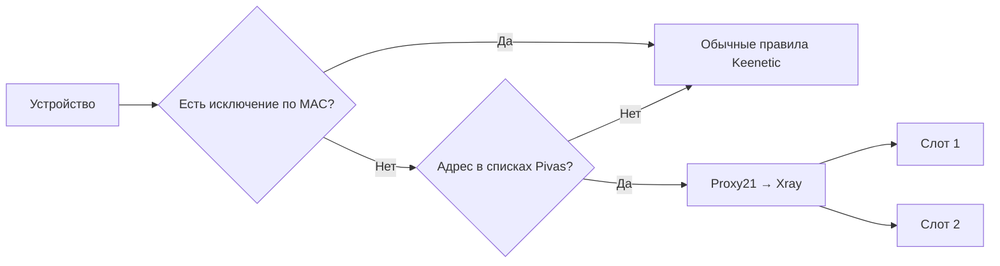

# Маршрутизация и DNS

Pivas — обвязка Xray, DNS-служб и сетевых правил Keenetic. Proxy client создаёт интерфейс `Proxy21`, который передаёт выбранный IPv4-трафик в локальный SOCKS Xray. IP-наборы, маркировка Netfilter и таблица маршрутов 1001 направляют нужные соединения в этот интерфейс. Имя системного интерфейса может отличаться между версиями KeeneticOS.

## DNS

| Запрос | Обработка |
| --- | --- |
| Вне списков | Штатный DNS Keenetic `127.0.0.1:53`; его вышестоящие серверы определяются настройками роутера |
| Домен слота 1 | dnsmasq `9753` → DNSCrypt `9153` → прокси слота 1 |
| Домен слота 2 | dnsmasq `9753` → DNSCrypt `9154` → прокси слота 2 |
| Устройство «Без Pivas» | Обычная обработка Keenetic без перехвата Pivas |

По умолчанию `DNS_VPN_FAILURE=closed`: при отказе VPN DNS выбранные домены не отправляются незаметно провайдерскому резолверу. Сам факт такого режима не означает глобальный kill switch для всего трафика устройства. Watchdog и его аварийное состояние проверяются отдельно командой `pivas dns watchdog status`.

## Ограничения

- IPv6-трафик текущими IPv4-правилами не охватывается.
- Собственный DoH приложений может обходить перехват DNS.
- Доменные правила зависят от DNS-кэша, общих адресов CDN и доступности доменного имени при анализе соединения. ECH может скрывать имя.
- Проверка утечек может обращаться к доменам, которых нет в вашей группе. IP страницы и DNS-резолверы её теста проверяют разные пути.
- CIDR маршрутизируется по адресу; импорт IP-сетей не даёт автоматического списка DNS-имён.
- Hysteria 2 требует доступного UDP; успешная работа VLESS/TCP не подтверждает доступность QUIC.

## Сертификаты

Публичные TLS-сертификаты проверяются по CA. Для частных сертификатов предусмотрена привязка SHA-256. Автоматическое получение отпечатка при первом импорте — доверие первому соединению, а не независимая проверка владельца сервера. Предпочтительно сверить отпечаток с администратором сервера. При смене сертификата существующий pin не обновляется молча.

## Нагрузка

Основную нагрузку создаёт передача трафика через Xray, особенно QUIC. Веб и бот можно выключить отдельно. Универсального расхода RAM для всех роутеров нет: измеряйте на своём устройстве разделом нагрузки или диагностикой. QUIC-помощник запускается кратковременно при импорте и не является дополнительной фоновой службой.
